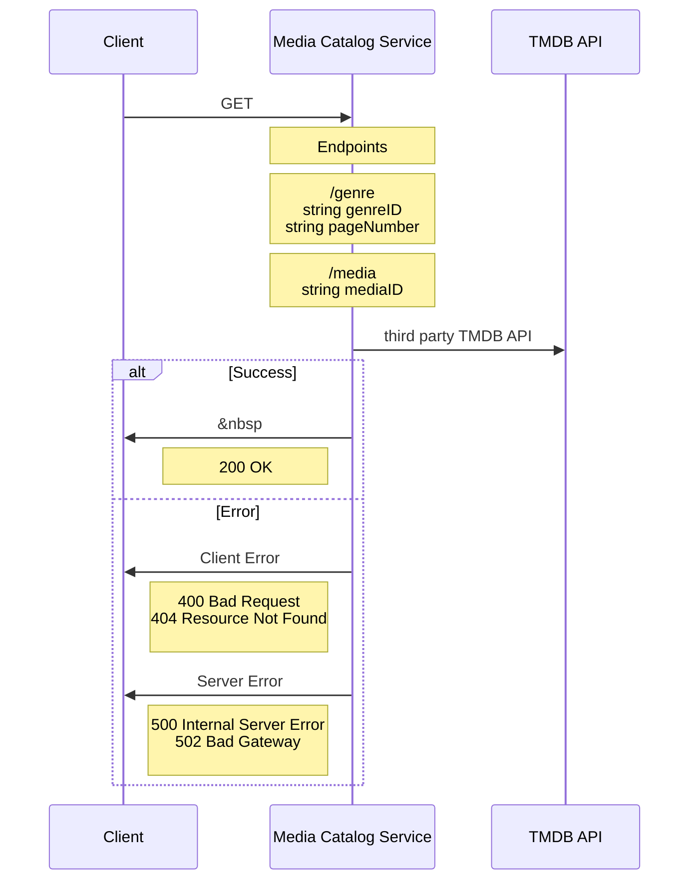

# Media Catalog Service

## Table of contents

- [Media Catalog Service](#media-catalog-service)
  - [About](#About)
  - [API](#api)
  - [Service Diagram](#service-diagram)
- [Development](#development)
  - [Installation](#installation)
    [](#)
  - [Quick Start](#quick-start)
    - [With Docker (live reload)](#with-docker-live-reload)
    - [Without Docker (live reload)](#without-docker-live-reload)
    - [Default local URL](#default-local-url)
      [](#)
  - [Linting, Formatting](#linting-formatting)
    - [ESLint](#eslint)
    - [Prettier](#prettier)

## About

This microservice leverages the TMDB API to fetch media (such as films) by genre ID or media ID.

## API

### Endpoints

`GET /genre`

#### Query Parameters

    string genreID - (comma separate the query string for multiple genres, e.g. "27,28")
    string pageNumber - optional, defaults to 1

#### Example Request (JavaScript Fetch API)

    fetch('http://localhost:4001/genre/27,28/page/1')
      .then(response => response.json())
      .then(data => console.log(data));

#### Example Response:

```
{
    "id": 635302,
    "title": "Demon Slayer -Kimetsu no Yaiba- The Movie: Mugen Train",
    "language": "ja",
    "year": "2020-10-16",
    "overview": "Tanjirō Kamado, joined with Inosuke Hashibira, a boy raised by boars who wears a boar's head, and Zenitsu Agatsuma, a scared boy who reveals his true power when he sleeps, boards the Infinity Train on a new mission with the Fire Hashira, Kyōjurō Rengoku, to defeat a demon who has been tormenting the people and killing the demon slayers who oppose it!",
    "voteAverage": 8.3,
    "popularity": 313.55,
    "backdropPath": "/qjGrUmKW78MCFG8PTLDBp67S27p.jpg",
    "posterPath": "/h8Rb9gBr48ODIwYUttZNYeMWeUU.jpg",
    "genreIDs": [
        [
            "Animation",
            16
        ],
        [
            "Action",
            28
        ],
        [
            "Adventure",
            12
        ],
        [
            "Fantasy",
            14
        ],
        [
            "Thriller",
            53
        ]
    ]
}
```

`GET /media`

#### Query Parameters

    string mediaID

#### Example Request (JavaScript Fetch API)

    fetch('http://localhost:4001/media/64690')
      .then(response => response.json())
      .then(data => console.log(data));

#### Example Response:

```
{
  "language": "en",
  "country": "US",
  "trailerUrlKey": "khI-05xwMco",
  "name": "Trailer 2",
  "type": "Trailer"
}
```

## Service Diagram



# Development

## Installation

    $ npm install
    $ touch .env

Add [TMDB API Key](https://developers.themoviedb.org/3/getting-started/introduction) as `TMDB_API_KEY` to `.env`

- _optional: to specify port, add `PORT` to `.env`_

#

## Quick Start

### With Docker (live reload)

#### Development

    $ make build
    $ make up
    $ make up-bg     // optional: run the process in the background

#### Production

    $ make build
    $ make up-prod

#### Stop the container

    $ make down

### Without Docker (live reload)

#### Development

    $ npm run dev

#### Production

    $ npm run build:release

### Default local URL

http://localhost:4001/

#

## Linting, Formatting, Testing

All commits must pass `ESLint` (AirBnB style guide/TypeScript recommended settings), `Prettier` checks, and `jest` unit tests using `lint-staged` and `husky` for pre-commit hooks

#### ESLint

    npm run lint
    npm run lint:fix        // automatically try to fix ESLint warnings/errors

#### Prettier

    npm run prettier

#### Jest

    npm run test
