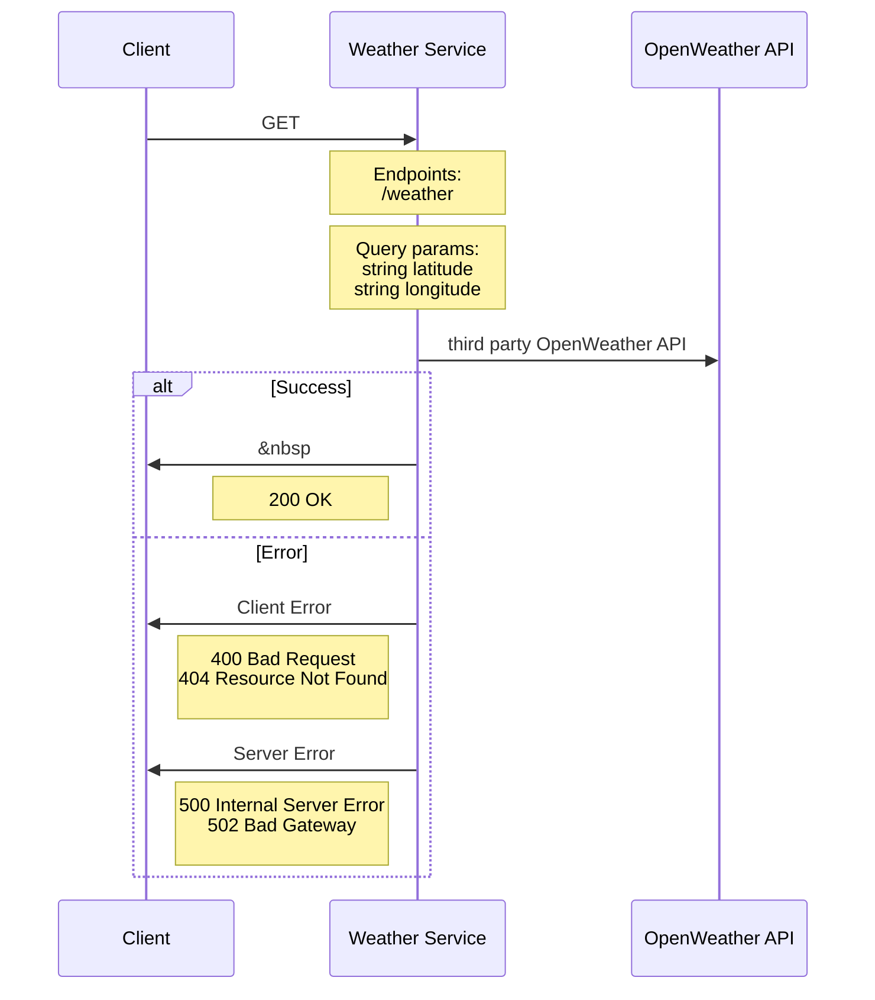

# Weather Service

## Table of contents

- [Weather Service](#weather-service)
  - [About](#About)
  - [API](#api)
  - [Service Diagram](#service-diagram)
- [Development](#development)
  - [Installation](#installation)
    
  - [Quick Start](#quick-start)
    - [With Docker (live reload)](#with-docker-live-reload)
    - [Without Docker (live reload)](#without-docker-live-reload)
    - [Default local URL](#default-local-url)
      
  - [Linting, Formatting](#linting-formatting)
    - [ESLint](#eslint)
    - [Prettier](#prettier)

## About

This microservice leverages the OpenWeather API to fetch temperature in imperial units by latitude and longitude.

## API

### Endpoints

`GET /weather`

#### Query Parameters

    string latitude
    string longitude

#### Example Request (JavaScript Fetch API)

    fetch('http://localhost:4000/weather?latitude=38&longitude=-122')
      .then(response => response.json())
      .then(data => console.log(data));

#### Example Response:

    {
        temperature: 27.19,
        weather: "rain",
        status: 200
    }

## Service Diagram

# Development

## Installation

    $ npm install
    $ touch .env

Add [OpenWeather API key](https://openweathermap.org/api) as `WEATHER_API_KEY` to `.env`

- _optional: to specify port, add `PORT` to `.env`_

#

## Quick Start

### With Docker (live reload)

#### Development

    $ make build
    $ make up
    $ make up-bg     // optional: run the process in the background

#### Production

    $ make build
    $ make up-prod

#### Stop the container

    $ make down

### Without Docker (live reload)

#### Development

    $ npm run dev

#### Production

    $ npm run build:release

### Default local URL

http://localhost:4000/

#

## Linting, Formatting, Testing

All commits must pass `ESLint` (AirBnB style guide/TypeScript recommended settings), `Prettier` checks, and `jest` unit tests using `lint-staged` and `husky` for pre-commit hooks

#### ESLint

    npm run lint
    npm run lint:fix        // automatically try to fix ESLint warnings/errors

#### Prettier

    npm run prettier

#### Jest

    npm run test
